OHBM Executive Function Trajectory Demo
================
Brenden Tervo-Clemmens
6/4/2024

## 1. Data Description and Overview

This is a demonstration of tools for considering statistical and
conceptual tests of trajectories across assessments and datasets. The
examples used here are from neuropsychological and computerized test of
goal-directed cognition or executive function. Theories of human
neurobehavioral development suggest executive functions mature from
childhood through adolescence reaching adulthood sometime in the second
decade of life (e.g., the teenage years in humans). As we
(Tervo-Clemmens et al.,2023, Nature Communications) and others have
discussed, the development and ultimate maturational timing of such
executive functions is often used to demarcate the boundaries of
adolescence in clinical practice, research, and policy.

By performing tests across assessments and datasets, we can attempt to
draw more robust developmental and lifespan inferences on these
questions.

This demonstration uses fully simulated data (acknowledging privacy and
data sharing challenges regarding data use agreements). Variable names
and age-related trajectories are based on results from Tervo-Clemmens et
al., 2023, Nature Communications. Briefly, simulated data used here were
generated from simulated uniform age distributions, non-linear
trajectories (via GAMs) fit to existing data, and multivariate normal
error distributions (approximately matched to observed correlations
among executive function measures).

     

## 2. Load Data and Functions

Here I provide a high level overview and demonstration of some of tools
for considering statistical and conceptual tests of trajectories across
assessments and datasets. For the sake of streamlining and readability,
the more complex code is sourced in a separate file. Let’s source these
functions and load the first dataset. For reproducibility on your
machine you will want to change these paths to the relevant location of
the cloned git directory.

## 2.1 Acquire Data

This document and it’s supporting materials are hosted on github as
[tervoclemmensb/OHBMED_EF](https://github.com/tervoclemmensb/OHBMED_EF).
We can download that if it doesn’t already exist.

If using these tools or functions please cite Tervo-Clemmens et al.,
2023, Nature Communications
<https://www.nature.com/articles/s41467-023-42540-8>

``` r
if(file.exists("generalfuncs.OHBMdemo.R")) {
   # nothing to do. we're in the directory with R and RData
   cat("already in code repository: ", getwd(), "\n")
} else if(!file.exists("OHBMED_EF/generalfuncs.OHBMdemo.R")) {
   system("git clone https://github.com/tervoclemmensb/OHBMED_EF")
}

# go to the cloned
if(file.exists("OHBMED_EF/generalfuncs.OHBMdemo.R")) setwd("OHBMED_EF") 
```

## 2.2 Load

``` r
source("generalfuncs.OHBMdemo.R") # functions: plotfitsfunc
load(file="Simdataset1_EF.Rdata") # "dataset1" object
load(file="Simdataset2_EF.Rdata") # "dataset2" object
```

      ## 3. Exploring the Data Let’s look at the data by plotting the
simulated “raw” data from one test (simulated Design Fluency from the
D-KEFS) as a function of age.

``` r
plot(dataset1$simdata1$age,dataset1$simdata1$DFL_acc)
```

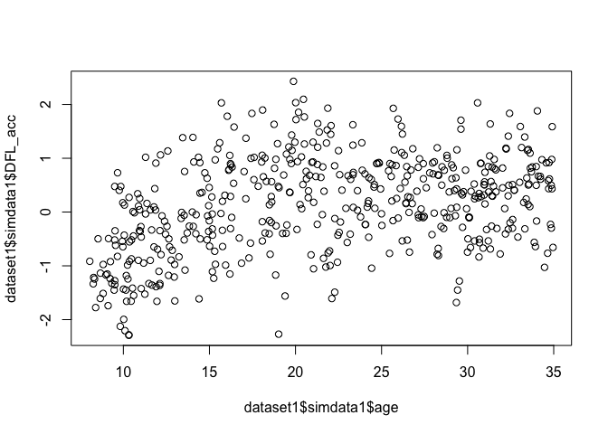<!-- -->

We may start to see an existing non-linear trajectory in these data just
by visualizing the plot. However, we can of course model this directly.
Let’s model this using the gam function in the mgcv package
(<https://cran.r-project.org/web/packages/mgcv/index.html>) and
visualizing the output. Note the example here uses some convenience
functions from our sourced functions but we will use a basic smoothed
term of age with the default penalized splines via the formula
mformula=as.formula(‘outcome\~s(pred)’) and we tell the code that age is
our predictor variable and DFL_acc is our outcome variable.

``` r
##internal call to mgcv is model<-mgcv::gam(mformula,data=dataset1$simdata1)
##convenience function handles model call and prediction (available via sourced functions from above)
DFLaccfit<-mgcvscalefits(dataset1$simdata1,outcomevars = "DFL_acc",predvars = "age",mformula = as.formula('outcome~s(pred)'))
##returned is a dataframe with the fit information
print(DFLaccfit[1:6,1:6])
```

    ##       pred nullcovar       fit        se        CI   fitscale
    ## 1 8.048096    no cov -1.466804 0.1577998 0.3155997 0.00000000
    ## 2 8.148096    no cov -1.445671 0.1534098 0.3068195 0.01141493
    ## 3 8.248096    no cov -1.424538 0.1490808 0.2981616 0.02282989
    ## 4 8.348096    no cov -1.403405 0.1448188 0.2896376 0.03424492
    ## 5 8.448096    no cov -1.382271 0.1406308 0.2812616 0.04566009
    ## 6 8.548096    no cov -1.361138 0.1365247 0.2730494 0.05707549

``` r
##plot single fit#####
DFLaccfit$type<-"acc" ##tell convenience function its an accuracy measure for the figure
DFLaccplot<-plotfitsfunc(DFLaccfit,dataset1$variableinfo1,dataset1$simdata1,rawdat=TRUE)
```

     

Let’s look now at the fitted trajectory.

``` r
print(DFLaccplot)
```

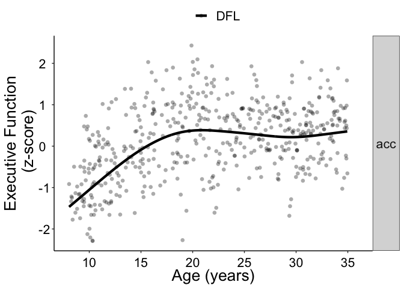<!-- -->

This plot alone gives us a sense of the potential developmental
inferences at the group level. For example, we see support for
neurodevelopemntal theories of performance developmentally stabilizing
towards the end of the second decade of life.

Of course, our current goal is to consider broader inferences across
multiple measures.

     

## 4. Model Fits from Multiple Assessments

We can visualize multiple developmental processes by repeating the
processes from above and stacking the derived model fits. Again, by
performing tests across assessments of the same broad construct of
executive function, we can draw more robust developmental and lifespan
inferences.

``` r
###get all the outcomes 
alldataset1outcomes<-names(dataset1$simdata1)[names(dataset1$simdata1)!="age"]
print(alldataset1outcomes)
```

    ##  [1] "PCET_acc"      "PNBK_acc"      "PCTP_acc"      "TOW_acc"      
    ##  [5] "DFL_acc"       "PCET_lat"      "PNBK_lat"      "PCTP_lat"     
    ##  [9] "CWI_lat"       "TMT_lat"       "Composite_lat" "Composite_acc"

``` r
fitsalldataset1<-mgcvscalefits(dataset1$simdata1,outcomevars = alldataset1outcomes,predvars = "age",mformula = as.formula('outcome~s(pred)'))
```

Let’s now visualize all the fits. We will remove the individual data
points for clarity and provide a shape to the lines so we know which
model fit goes with which measure.

``` r
dataset1plots<-plotfitsfunc(fitsalldataset1,dataset1$variableinfo1,dataset1$simdata1,points=TRUE)
print(dataset1plots)
```

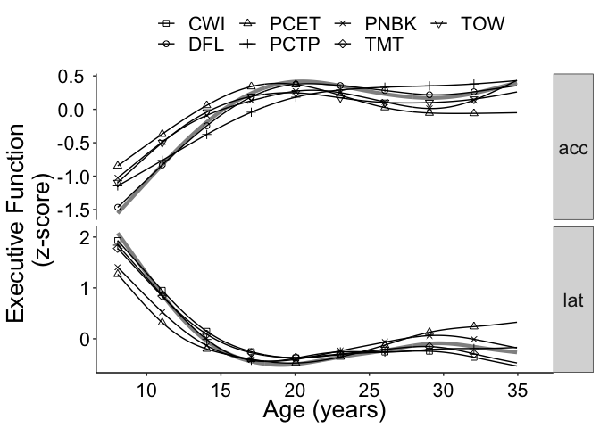<!-- -->

We can visualize the consistency across measures in the age trajectory.
From a lifespan perspective, this helps understand similarities in the
developmental process. We can also see consistency towards the
previously discussed developmental theories on rapid development during
childhood and early adolescence that stabilizes during the second decade
of life. However, we may also be interested in interrogating specifics
about the developmental timing and shape of these trajectories.

     

## 5. Developmental Inference from Derivatives

Ideally we would make quantitative inferences about developmental timing
and the shape of trajectories. One way that we and others (e.g.,
Simmonds et al., 2014, NeuroImage; Calabro et al., 2020, Cerebral
Cortex; Tervo-Clemmens et al., 2023, Nature Communications) have done
this is to statistically examine the first derivative of the fitted
trajectories.

Let’s return to our first example of design fluency. For simplicity we
will remove the raw data points and just focus on the trajectory.

``` r
DFLaccplot2<-plotfitsfunc(DFLaccfit,dataset1$variableinfo1,dataset1$simdata1,rawdat=FALSE)
print(DFLaccplot2)
```

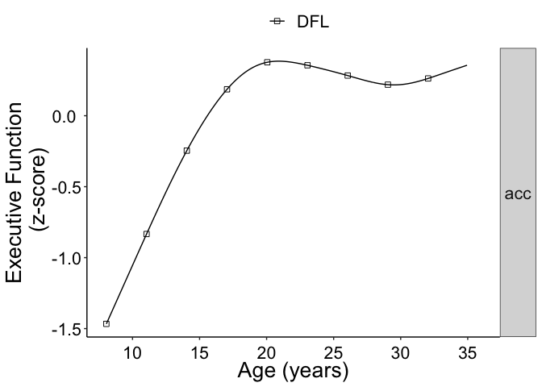<!-- -->

Using tools from the gratia package
(<https://cran.r-project.org/web/packages/gratia/index.html>) we can
also examine the first derivative of this trajectory and its confidence
interval (via posterior simulation: see package for more details). See
the sourced functions for more details beyond these convenience
functions.

Here we plot the first derivative and its 95% CI. This plotting function
will provide color (red if positive, blue if negative) for periods where
the CI does not include zero.

``` r
DFLderivdat<-mgcvgam_growthrate_multiplot(df=dataset1$simdata1,outcomevars = "DFL_acc",predvars='age',mformula=as.formula('outcome~s(pred)'))
DFLderivdatplot<-derivplot_unthresholded(DFLderivdat$derivdata)
print(DFLderivdatplot)
```

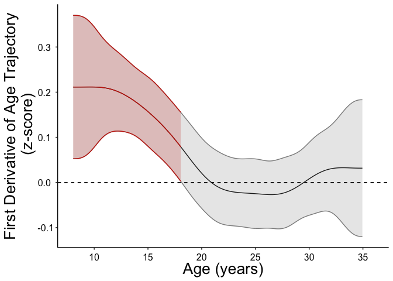<!-- -->

     

     

Instead of looking at the full derivative and its CI, we might also make
this a 1D heat plot, where just utilize the color, where again color is
displayed when its significant and no color displayed when its not. We
and others have used such maps of significance of derivative to chart
lifespan processes. For example, we can look at the ages when there is
significant change and when this stops as an insight into developmental
processes. We will provide a second bar (all white) below to anchor this
developmentally for key periods at 10, 12, 15, 18 years old.

   

``` r
DFLderivdatplotraster<-mgcvgam_growthrate_multiplot(df=dataset1$simdata1,outcomevars = "DFL_acc",predvars='age',mformula=as.formula('outcome~s(pred)'),devageguides=TRUE)
print(DFLderivdatplotraster$returnplot)
```

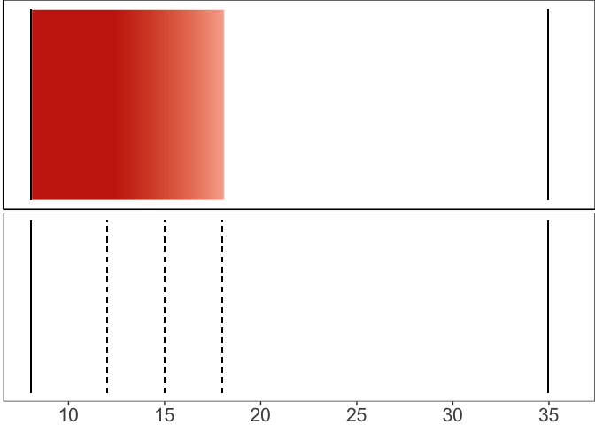<!-- -->

This further gives us insight and support for developmental theory
wherein significant age-related changes occur during early in
adolescence that then stabilize (i.e., no more age-related change)
around 18-years-old.

     

## 5. Derivatives of Multiple Assessments

In addition to looking at the derivative for a single executive function
measure, here our emphasis is on drawing conclusions across mutiple
measures. Let’s repeat the process now for all of the measures. We will
plot the accuracy and latency measures separate for consistency.

    Accuracy Measures

``` r
###dataset1
dataset1accvars<-dataset1$variableinfo1$outcome[dataset1$variableinfo1$type=="acc" & !is.na(dataset1$variableinfo1$outcome)]
ggderivplotsacc<-mgcvgam_growthrate_multiplot(df=dataset1$simdata1,outcomevars = dataset1accvars,predvars='age',mformula=as.formula('outcome~s(pred)'))
print(ggderivplotsacc$pairswithfill)
```

    ##         outcome pred
    ## 1 Composite_acc  age
    ## 2      PCET_acc  age
    ## 3      PCTP_acc  age
    ## 4      PNBK_acc  age
    ## 5       TOW_acc  age
    ## 6       DFL_acc  age

``` r
print(ggderivplotsacc$returnplot)
```

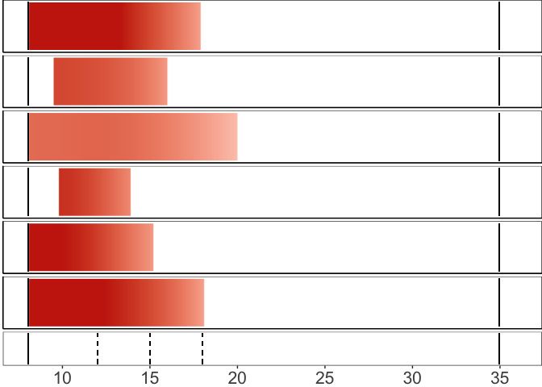<!-- -->     Latency
Measures

``` r
dataset1latvars<-dataset1$variableinfo1$outcome[dataset1$variableinfo1$type=="lat" & !is.na(dataset1$variableinfo1$outcome)]
ggderivplotslat<-mgcvgam_growthrate_multiplot(df=dataset1$simdata1,outcomevars = dataset1latvars,predvars='age',mformula=as.formula('outcome~s(pred)'))
print(ggderivplotslat$pairswithfill)
```

    ##         outcome pred
    ## 1 Composite_lat  age
    ## 2      PCET_lat  age
    ## 3      PCTP_lat  age
    ## 4      PNBK_lat  age
    ## 5       CWI_lat  age
    ## 6       TMT_lat  age

``` r
print(ggderivplotslat$returnplot)
```

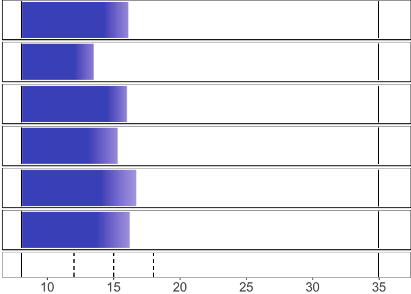<!-- -->

Supporting the similarities of the fits, the derivatives make clear the
consistency of the maturational timing (i.e., when no more development
is achieved) of this distinct measures. However, this is a single
dataset, what about integrating information and inferences across
datasets.

     

## 5. Chracterizing Trajectories across Datasets

Let’s load another dataset. Again, this is a simulated data (now from a
second independent dataset), with variable names and age trajectories
based on our previous work. See section 1 for more information.

We will load the data, fit the models for all the measures, and
visualize by repeating steps from above.

``` r
#Dataset 2
alldataset2outcomes<-names(dataset2$simdata2)[names(dataset2$simdata2)!="age"]
print(alldataset2outcomes)
```

    ##  [1] "ANTI_acc"              "MIX_acc"               "DMS_acc"              
    ##  [4] "SSP_acc"               "nfixbreak_fl"          "SOC_acc"              
    ##  [7] "best_acc_m_exclude_fl" "ANTI_lat"              "MIX_lat"              
    ## [10] "DMS_lat"               "MGS_lat"               "Composite_lat"        
    ## [13] "Composite_acc"

``` r
fitsalldataset2<-mgcvscalefits(dataset2$simdata2,outcomevars = alldataset2outcomes,predvars = "age",mformula = as.formula('outcome~s(pred)'))

dataset2plots<-plotfitsfunc(fitsalldataset2,dataset2$variableinfo2,dataset2$simdata2)
print((dataset2plots+ggtitle("Dataset 2 Fits")+theme(plot.title = element_text(hjust = 0.5))))
```

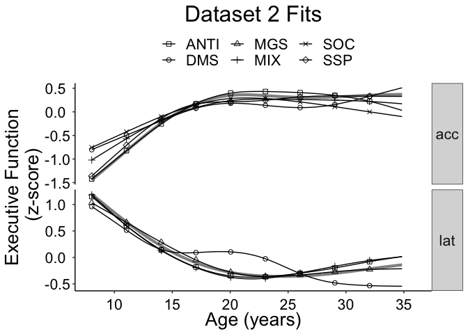<!-- -->

 

Bringing back the fits from dataset 1, we can the high degree of
similarity of between the two datasets, which gives us more confidence
in our overall inferences regarding our developmental inferences.

``` r
print((dataset1plots+ggtitle("Dataset 1 Fits")+theme(plot.title = element_text(hjust = 0.5))))
```

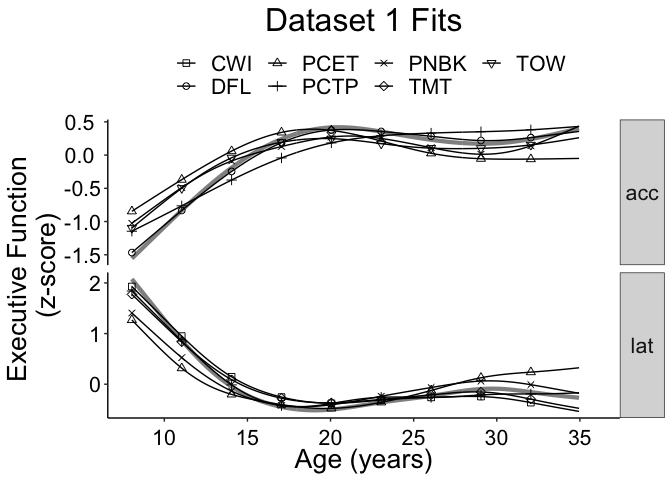<!-- -->

 

We likewise see the same general pattern with the derivatives. For
example, here are the accuracy trajectories from both datasets.

 

``` r
dataset2accvars<-dataset2$variableinfo2$outcome[dataset2$variableinfo2$type=="acc" & !is.na(dataset2$variableinfo2$outcome)]
dataset2latvars<-dataset2$variableinfo2$outcome[dataset2$variableinfo2$type=="lat" & !is.na(dataset2$variableinfo2$outcome)]

ggderivplotsacc2<-mgcvgam_growthrate_multiplot(df=dataset2$simdata2,outcomevars = dataset2accvars,predvars='age',mformula=as.formula('outcome~s(pred)'))
print(ggderivplotsacc2$returnplot+ggtitle("Dataset 2 Accuracy Measures Derivatives")+theme(plot.title = element_text(hjust = 0.5)))
```

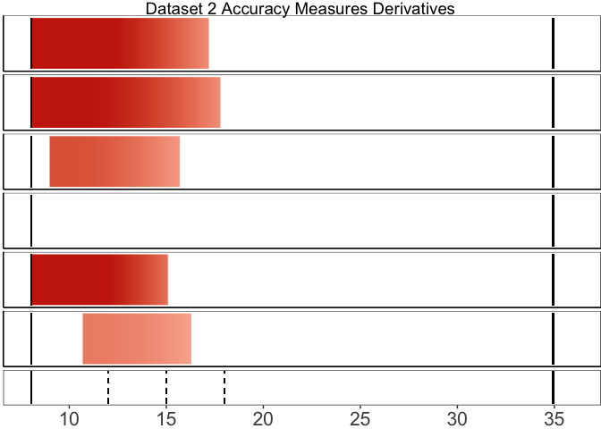<!-- -->

``` r
print(ggderivplotsacc$returnplot+ggtitle("Dataset 1 Accuracy Measures Derivatives")+theme(plot.title = element_text(hjust = 0.5)))
```

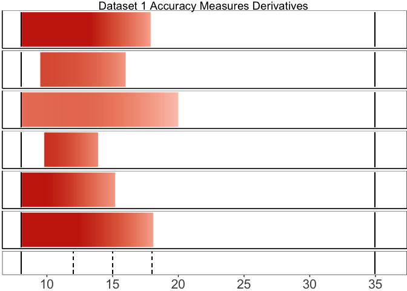<!-- -->

These inferences are helpful from a general reproducibility perspective
to support the proposed developmental theories. In the broader
presentation we will put these into more context and preview further
potential examples and extensions of these foundational approaches.
